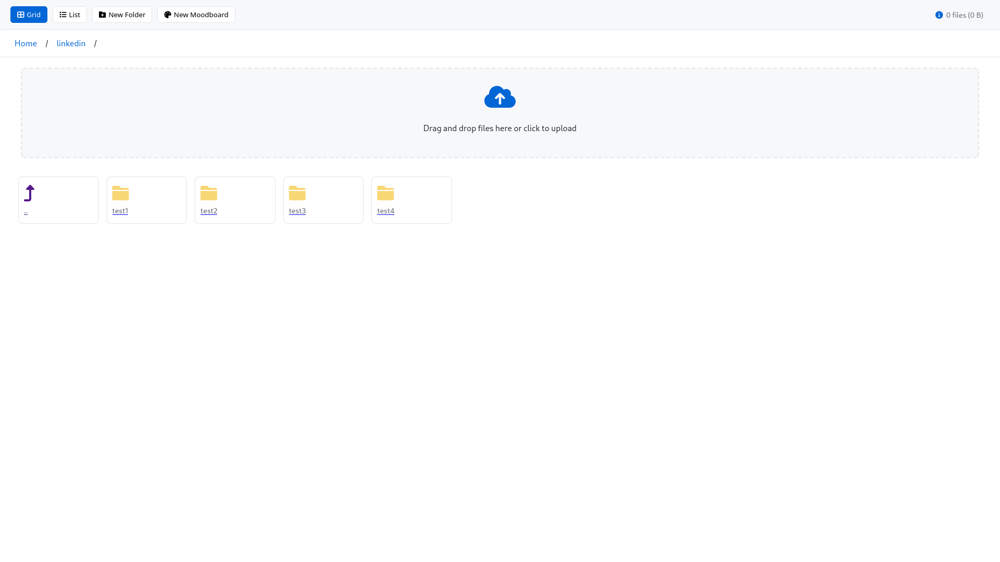

# File Server

A modern web-based file manager with drag-and-drop support, folder organization, and mobile-friendly interface.



## Features

- 📂 File and folder management
- 🔄 Drag and drop file uploads
- 📱 Responsive design
- 🌐 QR code for mobile access
- 📊 Grid and list views
- 🗂️ File organization with folders
- 🎨 Modern, clean interface
- 📲 WebDAV support

## Quick Start

```bash
# Clone the repository
git clone https://github.com/yourusername/fileserver.git
cd fileserver

# Install dependencies
make install

# Build and run
make run
```

Access the file server at `http://localhost:8080`

## Installation Requirements

- Go 1.16 or higher
- Make (optional, for using Makefile commands)

## Usage

### Basic Commands

```bash
make run          # Build and start the server
make build        # Build the binary only
make clean        # Clean build artifacts
make install      # Install/update dependencies
```

### File Management

- **Upload Files**: Drag and drop files into the upload zone or click to select
- **Create Folders**: Click the "New Folder" button
- **Move Files**: Drag files into folders or use the context menu
- **Download Files**: Right-click a file and select "Download"
- **View Options**: Toggle between grid and list views

### Mobile Access

1. Start the server
2. Scan the QR code shown in the UI
3. Access your files from any device on the same network

### WebDAV Support

Connect using WebDAV at `http://your-ip:8080/dav/`

## Project Structure

```
fileserver/
├── main.go           # Server implementation
├── templates/        # HTML templates
│   └── index.html   # Main UI template
├── uploads/         # File storage directory
├── Makefile         # Build automation
└── README.md        # This file
```

## Security Notes

- The server is intended for local network use
- No authentication is implemented by default
- Use with caution on public networks

## Contributing

1. Fork the repository
2. Create a feature branch
3. Commit your changes
4. Push to your branch
5. Create a Pull Request

## License

MIT License - feel free to use and modify as needed.

## Acknowledgments

- Font Awesome for icons
- Go standard library for core functionality
- QR code generation using github.com/skip2/go-qrcode